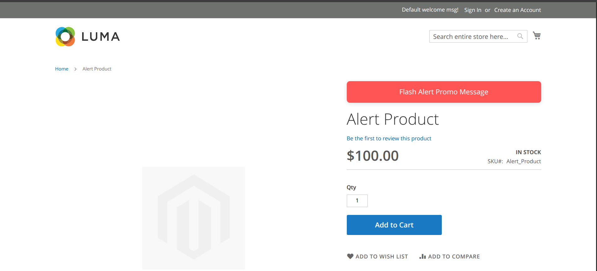
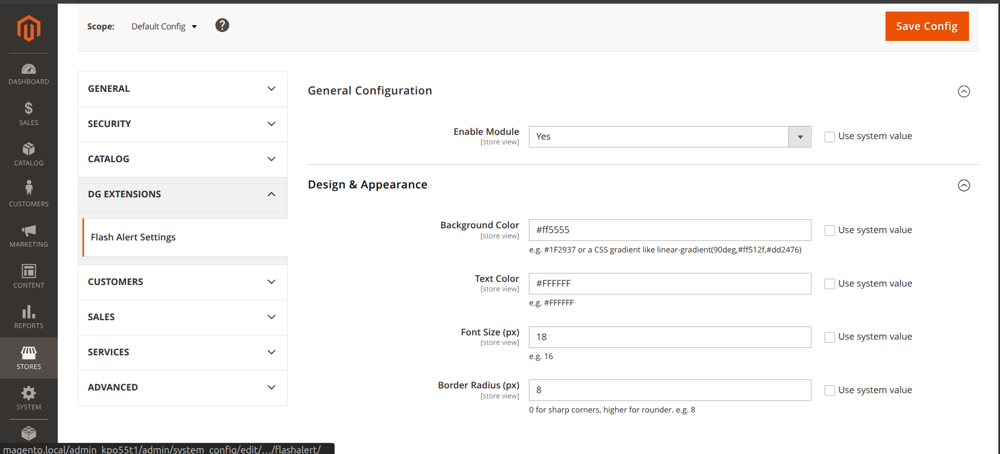
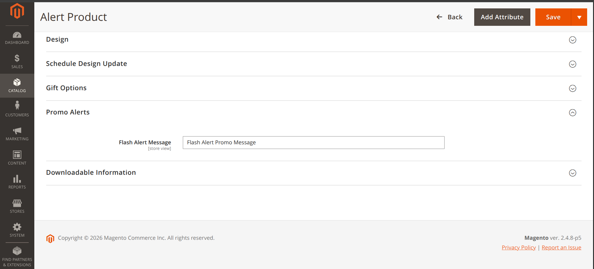

# Dg_FlashAlert

A lightweight Magento 2 module that displays a customizable **flash alert banner** above the product name on the product detail page using a product attribute and admin configuration.


---

## ✨ Features

- Display a custom flash alert banner above the product title.
- Product-specific alert message using the `flash_alert_text` product attribute.
- Configure banner appearance from the Magento Admin.
- Additional settings:
    - Background color
    - Text color
    - Font size
    - Border radius
- Multi-store / multi-website configuration support.

---

## 📦 Requirements

| Requirement | Version |
|-------------|---------|
| Magento | 2.4.x |
| PHP | 8.1+ |

---

### Manual Installation

Copy the module into:

```
app/code/Dg/FlashAlert
```

Then run:

```bash
bin/magento module:enable Dg_FlashAlert
bin/magento setup:upgrade
bin/magento setup:di:compile
bin/magento setup:static-content:deploy -f
bin/magento cache:flush
```

---

## ⚙️ Configuration

Navigate to:

```
Stores → Configuration → DG Extensions → Flash Alert Settings
```

### General

| Field | Description |
|-------|-------------|
| Enable Module | Enable or disable the module |

### Design

| Field | Description | Default |
|-------|-------------|---------|
| Background Color | Banner background color | `#FF0000` |
| Text Color | Banner text color | `#FFFFFF` |
| Font Size | Font size in pixels | `16` |
| Border Radius | Border radius in pixels | `0` |

All configuration values support **Default**, **Website**, and **Store View** scope.

---

## 🏷 Product Attribute

The banner is displayed only when the current product contains a value in the **flash_alert_text** attribute.

Example:

```
Flash Sale ends tonight!
```

or

```
Only 5 items left in stock.
```

If the attribute is empty, the banner is not displayed.

---

Screenshots








## 👤 Author

Email: ***dawoodgondaldev@gmail.com***
